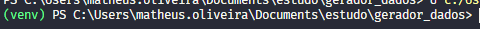

# gerador_dados_sql
Script para geração de dados automática no banco

Passo a passo para uso:

- dropar a base de dados antes de executar (se não apagar, vai dar erro)

- Instalar ambiente para instalação de bibliotecas
    python -m venv

- Entrar no ambiente venv criado
    Windows - cd venv/Scripts/activate
    Linux - source venv/bin/activate

    Se feito corretamente, após o comando aparece o (venv) ao lado do caminho no terminal

    

- Instalar bibliotecas
    pip install -r requirements.txt

- Rodar código _init_.py
    python -m src._init_.py